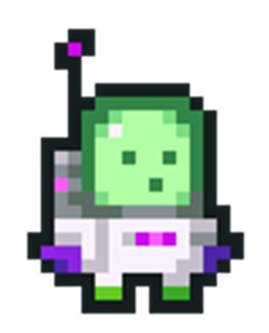

<h1>LYS 2025 AI Agent Era - Workshop Guide</h1>

**Welcome to the LYS 2025 AI Agent Era Workshop! We will be using the Multi-Agent Showcase for this hands-on session. Below is the guide that will progress you through three use cases, teaching you how to build AI agents.**

## Workshop Overview

You'll explore three use cases, each with its own AI agent:

1. **Showcase Agent** - Learn basic agent configuration with tools and reasoning
2. **HR Agent** - Discover how knowledge (RAG) and agent collaboration can improve agent capabilities
3. **Travel Agent** - Build a more complex real-world agent

### Tips for Success

- **Use preset prompts** - They're designed to showcase specific capabilities.
- **Experiment** - Try different combinations of settings or ask the AI your own questions. Your changes only affect your agent, not other peoples.
- **Stuck?** - Ask the **Showcase Agent** any questions you might have.

## A Few Quick Notes!

This application is in active development and there may be issues. Some agent responses might be slow (20-30s). If you run into any problems, please refrsh your page or try sending the message again.

AI agents can hallucinate! For example, it might give you a fake weather report without ever using a tool.

You may encounter an error message like the one below. This means the AI agent had an issue calling a tool. Try sending the message again or reload the page and try again.

`[ [ "ChatModelError", "Failed to produce a valid tool call." ] ]`

Now let's get started!

## Use Case 1: Showcase Agent

**Goal:** Get fimiliar with configuring agents and tools

**Description:** This agent is a helpful assistant that can answer questions about the workshop. It demonstrates fundamental agent capabilities such as tool usage and reasoning.

### Steps to Complete:

1. **Ask About this Workshop**

   - Try the preset prompt: _"Workshop Details"_

2. **Add the Weather Tool**

   - Select "Edit Agent" button on the top right
   - Select the "Tools" tab
   - Select the "Weather Tool" to enable it for the agent
   - Select either "Back to Chat" or "Save and Return to Chat"
   - Try the preset prompt: _"Bratislava Weather"_
   - See the agent thoughts and tool calls in the chat window
   - Select one of the thoughts or tool calls in the chat to view more details

3. **Multiple Tools**

   - Select "Edit Agent" and the "Tools" tab
   - Select the "Random Number Generator" tool to enable it for the agent
   - Select either "Back to Chat" or "Save and Return to Chat"
   - Try the preset prompt: _"Math Question"_
   - See the agent using mulitple tools

4. **Change Thinking Style**

   - Select "Edit Agent" and under the "Agent" tabs "Thinking" section, select "Only once at start"
   - Select either "Back to Chat" or "Save and Return to Chat"
   - Re-run your last prompt to see the the difference in the agent's thinking pattern

5. **Finished**
   - Feel free to stay here and experiment as much as you like
   - When you are ready to move on, select the HR Agent tab at the bottom of the screen

## Use Case 2: HR Agent

**Goal:** Configure knowledge retrieval and multi-agent collaboration

**Description:** This is an HR agent that helps employees with inquiries by accessing knowledge bases and collaborating with other, more specialized HR agents.

### Steps to Complete:

1. **Test Without Knowledge**

   - Try the preset prompt: _"Company Vacation Policy"_
   - The agent cannot answer the actual policy (30 days vacation) without access - it may hallucinates an answer!

2. **Add Company Policy Knowledge**

   - Select "Edit Agent" and the "Knowledge" tab
   - Enable "HR Company Policy" knowledge base
   - Select either "Back to Chat" or "Save and Return to Chat"
   - Re-ask the vacation policy question
   - See how RAG (Retrieval Augmented Generation) provides accurate, up to date information

3. **Enable Agent Collaboration**

   - Select "Edit Agent" and the "Collaborators" tab
   - Add the "Leave Management Agent" as a collaborator
   - Select either "Back to Chat" or "Save and Return to Chat"
   - Try the preset prompt: _"Request Vacation"_
   - Watch two agents collaborate to handle your request

4. **Finished**
   - Feel free to stay here and experiment as much as you like
   - When you are ready to move on, select the Travel Agent tab at the bottom of the screen

## Use Case 3: Travel Agent

**Goal:** Use web search and specialized tools for comprehensive travel planning

**Description:** This is a travel planning agent that can help plan a vacation (using real web search), create bookings, or create iteneraries.

### Steps to Complete:

1. **Configure the Agent**

   - This agent is barebones to start. We need to add the necessary parts!
   - Add the system prompt instructions:

`Your goal is to help travelers plan their perfect trips by coordinating information about destinations. You help the user plan and book vacations. You are a knowledgeable travel destination expert with deep expertise in global attractions, cultural insights, and local history. When researching destinations, first establish foundational information through web search to understand the locations basic context, then use targeted web searches to discover current attractions, seasonal events, and cultural considerations. Always provide  travelers with comprehensive information including must-see attractions, cultural customs, local transportation options, and insider tips. Ensure all recommendations are specific to the destination and tailored to create authentic travel experiences. Keep your responses very concise!`

- Enable the necessary tools - think about which ones the agent will need!

2. **Plan Vacation**

   - Try the preset prompt: _"Plan a Vacation"_
   - Watch the agent search flights and accommodations

3. **Create Bookings**

   - Try the preset prompt: _"Create Bookings"_
   - See how the agent can creates bookings (in reality this agent would have access to your personal accounts!)

4. **Generate Itinerary**
   - Try the preset prompt: _"Create Itenerary"_
   - See how the agent combines information to create valuable output

## Finished?

- Experiment by creating your own system prompt instead of the travel agent
- Go visit [MCP Servers](https://mcpservers.org/all) to explore other tools. Think of other agents you'd want to build!

## Key Takeaways

Now you should understand:

✅ How to configure agents with tools and knowledge bases  
✅ How thinking mode reveals agent reasoning  
✅ How agents can collaborate to solve complex tasks  
✅ How RAG enables agents to access external knowledge  
✅ How agents can search the web and perform real-world actions
